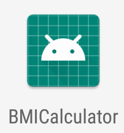
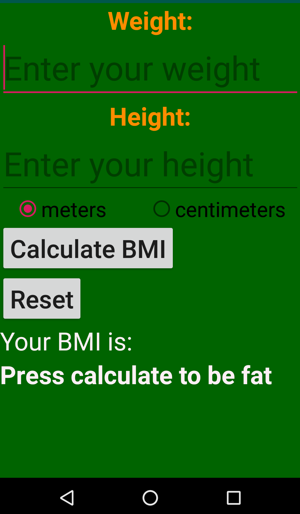

# BMICalculator

A simple yet very promising android application to compute BMI.

# Installation

The application was built with Android studio and is not yet available anywhere except here. There's no plan to publish it for now.
To install it one should clone the project through `git clone git@github.com:Knoblauchpilze/BMICalculator.git` and then import it to the studio.

# Usage

The user should fill their weight and height and then press `Calculate BMI`. That's it. The future of the UI is there peeps ! Behold !

# Features

Can handle BMI from height in centimeters and meters. No controls whatsoever are performed to check whether it makes sense but that's not the point.
